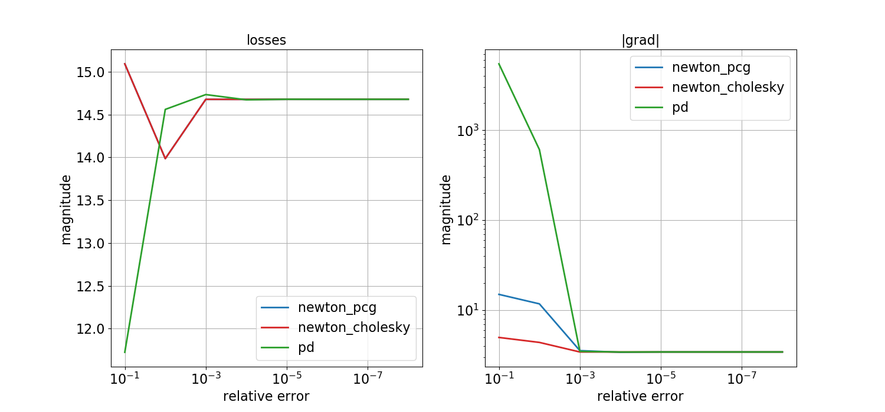
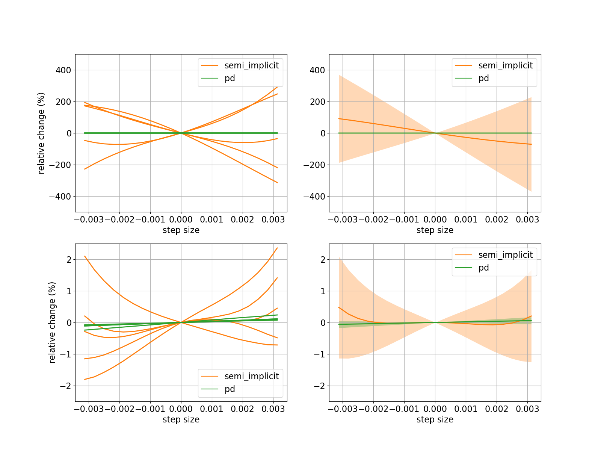

# Differentiable Projective Dynamics

[](https://travis-ci.com/mit-gfx/diff_pd)

## Recommended systems
- Ubuntu 18.04
- (Mini)conda 4.7.12 or higher
- GCC 7.5 (Other versions might work but we tested the codebase with 7.5 only)

## Installation
```
git clone --recursive https://github.com/mit-gfx/diff_pd.git
cd diff_pd
conda env create -f environment.yml
conda activate diff_pd
./install.sh
```
If you would like to enable multi-threading, set the thread_ct in the options object in the python script. The examples below all use a default of 4 threads for parallel processes. Using 1 will force the program to run sequentially.

### (Optional) Using Pardiso for the linear solver
Let `PARDISO_HOME` be the folder that you saved your Pardiso license file and the binary file. For example, if `/home/pardiso/pardiso.lic` and `/home/pardiso/libpardiso600-GNU720-X86-64.so` are your license and binary files, then `PARDISO_HOME` should be set to `/home/pardiso`. Please note that the whole codebase relies on this particular Pardiso version --- newer or older Pardiso may cause some weird segmentation fault issues on the Python end. See the comments in `cpp/CMakeLists.txt` for details.
- Set the environment variable `PARDISO_LIC_PATH`:
```
export PARDISO_LIC_PATH=<PARDISO_HOME>
export PARDISOLICMESSAGE=1
```
- Pardiso requires `lapack` and `blas`:
```
sudo apt-get install liblapack-dev
sudo apt-get install libblas-dev
```
As of the date this README is written, the version we use is `3.7.1-4ubuntu1`:
```
Reading package lists... Done
Building dependency tree
Reading state information... Done
libblas-dev is already the newest version (3.7.1-4ubuntu1).
liblapack-dev is already the newest version (3.7.1-4ubuntu1).
0 upgraded, 0 newly installed, 0 to remove and 132 not upgraded.
```
- Recompile the codebase with an optional `pardiso` argument:
```
./install.sh pardiso
```

## Examples
Navigate to the `python/example` path and run `python [example_name].py` where the `example_name` could be the following:

### Display
- `render_hex_mesh` explains how to use the external renderer (pbrt) to render a 3D hex mesh.
- `render_quad_mesh` explains how to use matplotlib to render a 2D quad mesh.

### Numerical check
- `state_force_2d` and `state_force_3d` test the implementation of state-based forces (e.g., friction, hydrodynamic force, penalty force for collisions) and their gradients w.r.t. position and velocity states.
- `pd_energy_2d` and `pd_energy_3d` test the implementation of vertex-based and element-based projective dynamics energies.
- `actuation_2d` and `actuation_3d` test the implementation of the muscle model.
- `pd_forward` verifies the forward simulation of projective dynamics by comparing it to the solutions from Newton's method.
- `deformable_backward_2d` uses central differencing to numerically check the gradients in Newton-PCG, Newton-Cholesky, and PD methods. A 2D rectangle is simulated with some fixed boundary conditions and a random but constant external force for 1 second at 30 fps. The loss is defined as a weighted sum of the final position and velocity and the gradients are computed by back-propagation.
- `deformable_backward_3d` tests the forward simulation and back-propagation in 3D with three methods (Newton-PCG, Newton-Cholesky, and PD) and with dirichlet boundary conditions, gravity, and collisions. `deformable_backward_3d` also plots the loss and magnitude of the three methods against the relative tolerance that was used to compute them.
- `collision_2d` compares the forward and backward implementation of collision models in Newton's methods and PD.

### Quasi-static solvers
- `deformable_quasi_static_3d` solves the quasi-static state of a 3D hex mesh. The hex mesh's bottom and top faces are fixed but the top face is twisted.

### Demos
- `benchmark_3d` compares and reports the time cost of one forward call and one backward call in Newton-PCG, Newton-Cholesky, and PD. Below is the time cost on a benchmark cantilever beam with 8019 DoFs. We simulated the example for 30 frames with dt = `0.01`. `forward` and `backward` indicates the time cost for forward simulation (25 frames in total) and back propagation respectively.


- `landscape_3d` compares the PD solver with the semi-implicit time integeration method to demonstrate that the loss and grad landscapes are smoother with full implicit methods.

- `tendon_routing_3d` implements a simple tendon routing example with forward and backward PD and two Newton baselines. The goal is to let the endpoint of the stick finger reach a target point in the 3D space.
- `cantilever_3d` and `bouncing_ball_3d` are two system identification demos.
- `hopper_3d` is a 2.5D hopper demo.