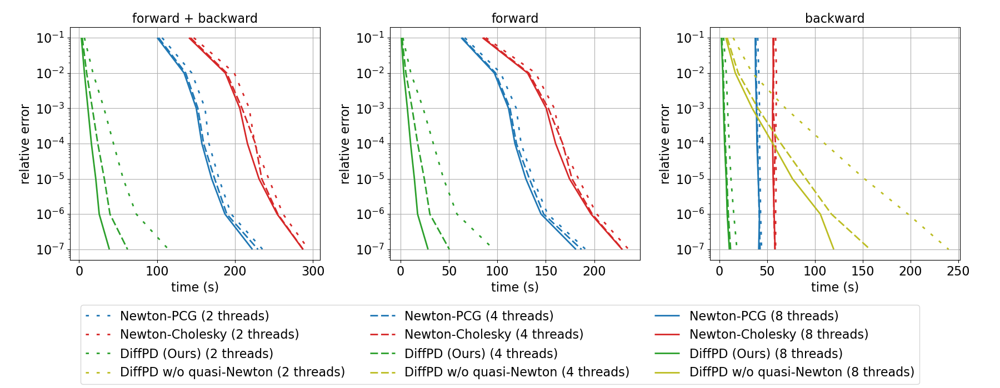

# Differentiable Projective Dynamics

[](https://travis-ci.com/mit-gfx/diff_pd)

## Recommended systems
- Ubuntu 18.04
- (Mini)conda 4.7.12 or higher

## Installation
```
git clone --recursive https://github.com/mit-gfx/diff_pd.git
cd diff_pd
conda env create -f environment.yml
conda activate diff_pd
./install.sh
```
If you would like to enable multi-threading, set the thread_ct in the options object in the python script. The examples below all use a default of 4 threads for parallel processes. Using 1 will force the program to run sequentially.

## Examples
Navigate to the `python/example` path and run `python [example_name].py` where the `example_name` could be the following:

### Display
- `render_hex_mesh` explains how to use the external renderer (pbrt) to render a 3D hex mesh.
- `render_quad_mesh` explains how to use matplotlib to render a 2D quad mesh.

### Numerical check
- `elastic_energy_2d` and `elastic_energy_3d` test the implementation of `ElasticEnergy`, `ElasticForce`, and `ElasticForceDifferential`.
- `state_force_2d` and `state_force_3d` test the implementation of state-based forces (e.g., friction, hydrodynamic force, penalty force for collisions) and their gradients w.r.t. position and velocity states.
- `pd_energy_2d` and `pd_energy_3d` test the implementation of vertex-based and element-based projective dynamics energies.
- `pd_forward` verifies the forward simulation of projective dynamics by comparing it to the solutions from Newton's method.
- `deformable_backward_2d` uses central differencing to numerically check the gradients in Newton-PCG, Newton-Cholesky, and PD methods. A 2D rectangle is simulated with some fixed boundary conditions and a random but constant external force for 1 second at 30 fps. The loss is defined as a weighted sum of the final position and velocity and the gradients are computed by back-propagation.
- `deformable_backward_3d` tests the forward simulation and back-propagation in 3D with three methods (Newton-PCG, Newton-Cholesky, and PD) and with dirichlet boundary conditions, gravity, and collisions. `deformable_backward_3d` also plots the loss and magnitude of the three methods against the relative tolerance that was used to compute them.

### Quasi-static solvers
- `deformable_quasi_static_3d` solves the quasi-static state of a 3D hex mesh. The hex mesh's bottom and top faces are fixed but the top face is twisted.
- `rotating_deformable_quasi_static_2d` solves the quasi-static state of a 2D square in a rotational frame with its four edges fixed to the frame.
- `rotating_deformable_quasi_static_3d` solves the quasi-static state of a 3D hex mesh but in a rotational frame. The frame spins around the vertical direction at a constant speed and one of the face is fixed to the frame.

### Dynamic solvers
- `rotating_deformable_2d` solves the dynamic motion of a 2D rectangle in a rotational frame.
- `rotating_deformable_3d` solves the dynamic motion of a 3D cube in a rotational frame.

### Collisions
- `collision_3d` shows a 3D cuboid hitting on the ground solved with an option to choose either explicit or implicit penalty force. The simulation is done with Newton-PCG, Newton-Cholesky, and PD. In the end, it will play three videos of almost identical motions, which also cross-validates the implementations of these three simulation methods. With the explicit method, the jumper gains more and more energy by hitting the ground. With the implicit method, the jumper becomes damped and a bit sticky.

### Demos
- `benchmark_3d` compares and reports the time cost of one forward call and one backward call in Newton-PCG, Newton-Cholesky, and PD. Below is the time cost on a benchmark cantilever beam with 4131 DoFs. We simulated the example for 30 frames with dt = `0.03`. `forward` and `backward` indicates the time cost for forward simulation (30 frames in total) and back propagation respectively. This result was generated with `OMP_NUM_THREADS=4`.

- `sticky_finger_3d` optimizes a constant force applied to the nodes of a cuboid whose bottom is fixed on the ground. The goal is to bend the cuboid so that the upper-right corner reaches a target 3D position with zero velocity after 1 second. Optimization results with Newton-PCG, Newton-Cholesky, and PD are reported on the terminal, and a video of the final solution will pop up and play in the end.
